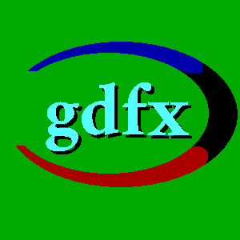

# GDFX Game Framework

The GDFX Game Framework is a C++ cross-platform game development framework.

## Building the Framework

Clone the repository with submodules, then build with CMake presets:

```bash
git submodule update --init --recursive
./scripts/build.sh debug
```

For an optimized build, use `release` instead of `debug`.

## Creating a New Game

From the directory where you want the new game folder:

```bash
gdfx/scripts/create-game.sh MyGame
cd MyGame
./scripts/build.sh debug
```

By default, `create-game.sh` initializes the generated game as a new git repository with an initial commit. Pass `--no-git` to skip that.

The generated project includes `CMakePresets.json`, so IDEs that understand CMake presets can configure the game directly.

## Project Layout

- `src/gdfx`: the GDFX Game Framework source code.
- `template`: starter game project copied by `create-game.sh`.
- `scripts`: convenience wrappers around the CMake presets.
- `src/SDL` and `src/SDL_mixer`: SDL submodules used when `GDFX_USE_SYSTEM_SDL` is not enabled.
